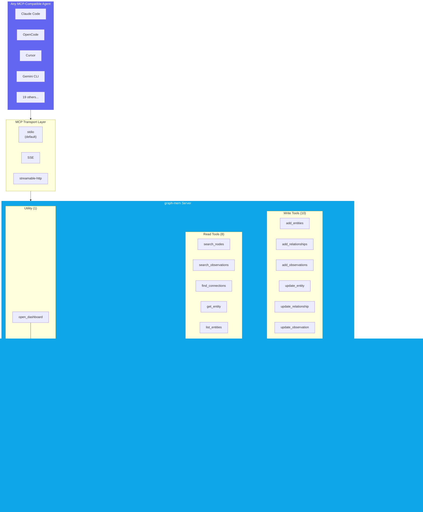
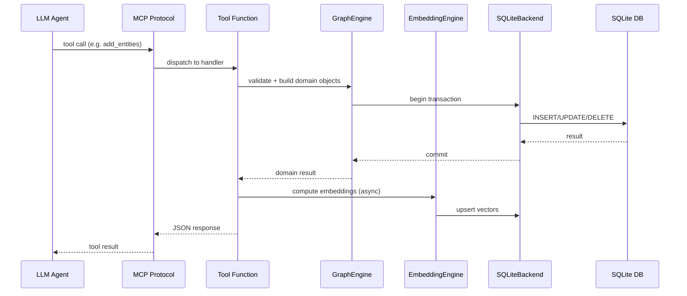
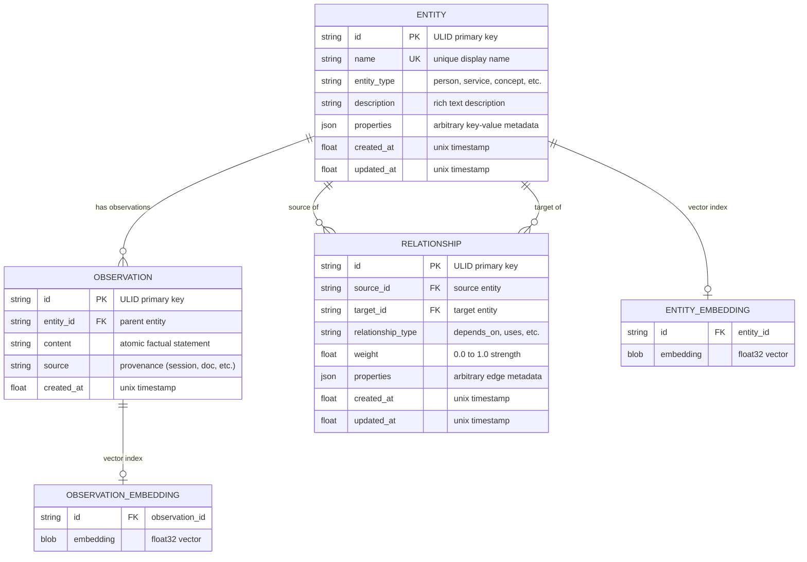
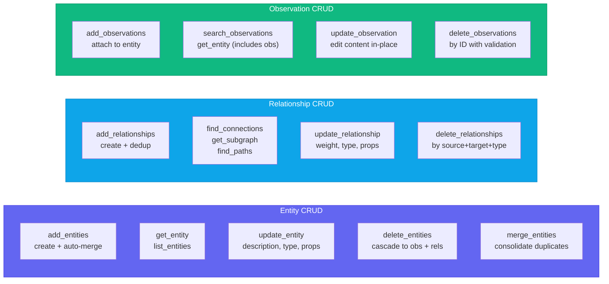
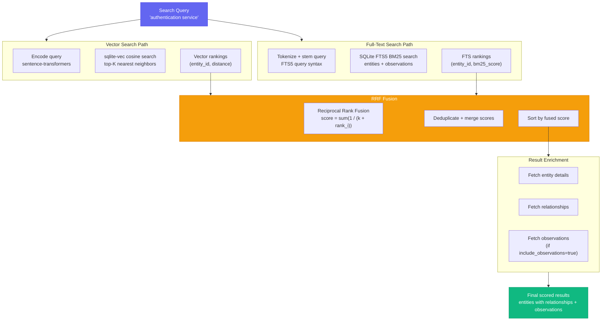
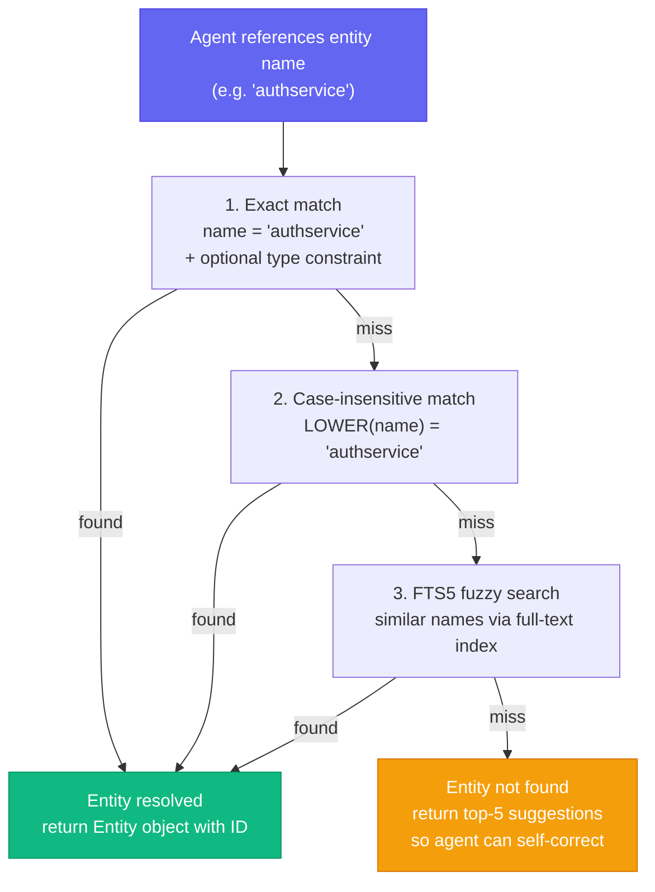
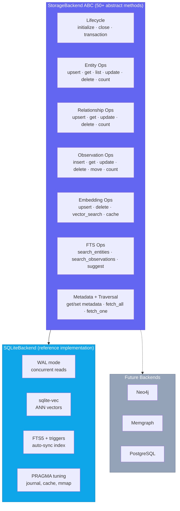

# graph-mem

> Persistent knowledge graph memory for LLM-powered CLI agents

[](LICENSE)
[](https://www.python.org)

**No API keys. No cloud provider. No external services.** graph-mem is a fully local MCP server that plugs into any MCP-compatible agent as a standard tool provider. Install it, add it to your MCP config, and your agent immediately gains persistent memory -- nothing else required.

### Supported Agents

<table>
<tr>
<td><b>Claude Code</b></td>
<td><b>OpenCode</b></td>
<td><b>Cursor</b></td>
<td><b>Windsurf</b></td>
<td><b>Codex CLI</b></td>
<td><b>Gemini CLI</b></td>
</tr>
<tr>
<td><b>GitHub Copilot</b></td>
<td><b>Amp</b></td>
<td><b>Kiro</b></td>
<td><b>Roo Code</b></td>
<td><b>Trae</b></td>
<td><b>Augment</b></td>
</tr>
<tr>
<td><b>Continue</b></td>
<td><b>Warp</b></td>
<td><b>KiloCode</b></td>
<td><b>Qoder</b></td>
<td><b>CodeBuddy</b></td>
<td><b>Droid (Factory)</b></td>
</tr>
<tr>
<td colspan="6"><b>Antigravity</b> · and any MCP-compatible agent</td>
</tr>
</table>

---

## What is this?

LLM-powered coding agents forget everything between sessions. They re-read files, re-discover architecture, and repeat mistakes. **graph-mem** fixes this by giving any MCP-compatible agent a persistent, per-project knowledge graph that combines graph storage, semantic vector search, and multi-hop traversal. It runs entirely locally -- no API provider accounts, no cloud dependencies, no Docker containers. Just `pip install graph-mem` and go.

### Why a graph, not just a vector store?

Vector search finds _similar_ things. Graphs find _connected_ things. When an agent asks "what depends on the auth service?", a vector store returns text that mentions auth. A knowledge graph traverses the actual dependency edges and returns every upstream consumer -- even ones that never mention "auth" in their description. graph-mem gives you both: vector similarity for fuzzy discovery, graph traversal for structural queries.

---

## For your agent's consideration...

Paste this prompt into your agent:

```
I want you to give yourself persistent memory using graph-mem. Run the following:

pip install graph-mem
graph-mem install opencode    # or: claude, cursor, windsurf, codex, gemini, copilot, amp, kiro, roocode, trae, augment, continue, warp, kilocode, qoder, codebuddy, droid, antigravity

This installs a skill file that teaches you how to use the 19 MCP tools.
The server should already be configured in your MCP config. If not, add it:

{
  "mcpServers": {
    "graph-mem": {
      "command": "graph-mem",
      "args": ["server", "--project-dir", "/path/to/your/project"]
    }
  }
}

Now start using the knowledge graph:

1. read_graph() to see current state
2. search_nodes("relevant topic") to find existing knowledge
3. add_entities, add_relationships, add_observations as you learn things
4. update_observation / update_relationship to fix mistakes in-place
5. open_dashboard() to explore the graph visually in your browser
6. At session end, capture anything important you discovered

Your goal: build a rich knowledge graph of this project so future sessions
start with full context instead of from zero. Search before adding to avoid
duplicates. Be specific with entity names and types.
```

---

## Installation

### Option 1: pip (Recommended)

```bash
pip install graph-mem
graph-mem server
```

### Option 2: uvx (zero pre-install)

```bash
uvx graph-mem server
```

`uvx` downloads the package into an isolated environment and runs it in one command. Nothing to pre-install beyond [uv](https://docs.astral.sh/uv/).

### Option 3: From source

```bash
git clone https://github.com/Sathvik-1007/GraphMem-MCP
cd graph-mem
pip install -e ".[full,dev]"
graph-mem server
```

### Optional extras

```bash
pip install "graph-mem[embeddings]"   # sentence-transformers for local embeddings
pip install "graph-mem[onnx]"         # ONNX runtime for ~3x faster inference
pip install "graph-mem[ui]"           # aiohttp for interactive graph visualisation
pip install "graph-mem[full]"         # all of the above
```

---

## Quick Start

**1. Install the skill for your agent:**

```bash
graph-mem install claude        # Claude Code
graph-mem install opencode      # OpenCode
graph-mem install cursor        # Cursor
graph-mem install windsurf      # Windsurf
graph-mem install codex         # Codex CLI
graph-mem install gemini        # Gemini CLI
graph-mem install copilot       # GitHub Copilot
graph-mem install amp           # Amp
graph-mem install kiro          # Kiro
graph-mem install roocode       # Roo Code
graph-mem install trae          # Trae
graph-mem install augment       # Augment
graph-mem install continue      # Continue
graph-mem install warp          # Warp
graph-mem install kilocode      # KiloCode
graph-mem install qoder         # Qoder
graph-mem install codebuddy     # CodeBuddy
graph-mem install droid         # Droid (Factory)
graph-mem install antigravity   # Antigravity
```

This writes a skill file that teaches your agent how to use all 19 MCP tools -- when to search, when to add entities, naming conventions, and common workflows.

**2. Configure MCP** by adding this to your agent's MCP config:

```json
{
  "mcpServers": {
    "graph-mem": {
      "command": "graph-mem",
      "args": ["server"]
    }
  }
}
```

With full customization:

```json
{
  "mcpServers": {
    "graph-mem": {
      "command": "graph-mem",
      "args": [
        "server",
        "--project-dir", "/path/to/my/project",
        "--embedding-model", "sentence-transformers/all-mpnet-base-v2",
        "--use-onnx",
        "--cache-size", "20000",
        "--log-level", "INFO"
      ]
    }
  }
}
```

That's it. Your agent now has persistent memory.

---

## Features

graph-mem exposes **19 MCP tools** -- ten for writing, eight for reading, and one utility. Full CRUD on every primitive: entities, relationships, and observations can all be created, read, updated, and deleted.

### Write Tools (10)

| Tool | Description |
|------|-------------|
| `add_entities` | Batch-create entities with optional observations; auto-merges on name conflict |
| `add_relationships` | Create typed, directed edges between entities; merges duplicates by max weight |
| `add_observations` | Attach factual statements to entities with optional source provenance |
| `update_entity` | Modify entity description, properties, or type in-place |
| `update_relationship` | Change weight, type, or properties of an existing edge without delete+re-create |
| `update_observation` | Edit observation text content in-place with automatic embedding recompute |
| `delete_entities` | Remove entities with cascade to relationships, observations, and embeddings |
| `delete_relationships` | Remove specific edges between entities, optionally filtered by type |
| `delete_observations` | Remove specific observations by ID with ownership validation |
| `merge_entities` | Combine duplicate entities: moves observations and relationships, deduplicates edges |

### Read Tools (8)

| Tool | Description |
|------|-------------|
| `search_nodes` | Hybrid semantic + full-text search with RRF fusion ranking |
| `search_observations` | Semantic search directly over observation text content |
| `find_connections` | Multi-hop BFS graph traversal with direction and type filters |
| `get_entity` | Full entity details with all observations and relationships |
| `list_entities` | Browse/paginate all entities with optional type filter |
| `read_graph` | Graph statistics: counts, type distributions, most-connected entities |
| `get_subgraph` | Extract neighborhood subgraph around seed entities |
| `find_paths` | Find shortest paths between two entities via BFS |

### Utility Tools (1)

| Tool | Description |
|------|-------------|
| `open_dashboard` | Launch interactive graph visualisation UI and return its URL |

---

## Architecture

### System Overview



Everything lives in a single SQLite database per project. No external services, no Docker containers, no API keys. The server communicates over MCP's standard stdio transport (SSE also supported) and stores all data in `.graphmem/graph.db` at your project root.

The database file is portable -- copy it between machines, check it into version control, or back it up like any other file.

---

### Tool Request Flow

Every tool call follows the same pattern through the stack:



---

## MCP Integration

graph-mem is a standard MCP (Model Context Protocol) server. It does not require any external provider, API key, or cloud account. It communicates with your agent over the MCP protocol (stdio by default, SSE and streamable-http also supported) and exposes 19 tools that the agent can call directly.

**What this means in practice:** once you add graph-mem to your agent's MCP config, the agent sees 19 new tools (`add_entities`, `search_nodes`, `find_connections`, `update_observation`, `open_dashboard`, etc.) in its tool list. The agent calls these tools the same way it calls any other MCP tool -- no special SDK, no provider integration, no authentication. It works with every MCP-compatible agent out of the box.

To verify it's working, ask your agent to run `read_graph()` -- it should return the current graph statistics (entity count, relationship count, etc.).

---

## Data Storage

By default, graph-mem stores its database at `.graphmem/graph.db` relative to the current working directory. You can control this with:

| Method | Example | Result |
|--------|---------|--------|
| `--project-dir` | `--project-dir /home/user/myproject` | Stores at `/home/user/myproject/.graphmem/graph.db` |
| `--db` | `--db /custom/path/memory.db` | Stores at exactly that path |
| `GRAPHMEM_DB_PATH` env | `export GRAPHMEM_DB_PATH=/tmp/test.db` | Stores at that path |
| Default | (nothing) | `.graphmem/graph.db` relative to CWD |

**Priority order:** `--db` > `--project-dir` > `GRAPHMEM_DB_PATH` env var > default.

The `.graphmem/` directory is automatically created if it doesn't exist. Add `.graphmem/` to your `.gitignore` if you don't want to track the database in version control.

---

## How It Works

### Data Model

The knowledge graph has three core primitives. Every primitive supports full CRUD -- create, read, update, and delete:



- **Entities** are named nodes with a type and description (e.g., `AuthService`, type `service`).
- **Relationships** are typed, directed, weighted edges between entities (e.g., `AuthService --DEPENDS_ON--> Database`).
- **Observations** are factual statements attached to entities (e.g., "Uses bcrypt for password hashing").
- **Embeddings** are sentence-transformer vectors stored alongside entities and observations for semantic search.

### CRUD Operations Map



### Hybrid Search Pipeline

`search_nodes` combines three retrieval strategies using Reciprocal Rank Fusion (RRF):



1. **Vector similarity** -- cosine distance against sentence-transformer embeddings of entity names, descriptions, and observations.
2. **Full-text search** -- SQLite FTS5 with BM25 ranking for keyword matching.
3. **RRF fusion** -- merges and re-ranks results from both strategies into a single scored list.

When no embedding model is installed, search gracefully degrades to FTS-only mode.

### Multi-Hop Traversal

`find_connections` walks the graph recursively using SQL CTEs, discovering indirect relationships up to a configurable depth. This surfaces connections that no flat search can find -- like tracing a function through three layers of abstraction to the database schema it ultimately modifies.


A query like `find_connections("AuthService", max_hops=3)` traverses the full chain `AuthService -> UserStore -> PostgresDB -> users_table`, even though `users_table` never mentions "auth."

### Entity Resolution

When the agent references an entity by name, graph-mem resolves it through a cascade:



1. **Exact match** -- case-sensitive name lookup, optionally scoped by entity type.
2. **Case-insensitive match** -- normalized comparison.
3. **FTS5 match** -- full-text search for partial or fuzzy names.
4. **Suggestions** -- if nothing matches, return the closest candidates so the agent can self-correct.

### Storage Backend Architecture



---

## CLI Reference

### Server

```bash
graph-mem server                          # stdio transport (default)
graph-mem server --transport sse          # SSE transport
graph-mem server --db /path/to/graph.db   # custom database path
graph-mem server --project-dir /my/project  # store memory in <dir>/.graphmem/

# Embedding customization
graph-mem server --embedding-model sentence-transformers/all-mpnet-base-v2
graph-mem server --no-onnx --embedding-device cuda
graph-mem server --cache-size 50000

# Tuning
graph-mem server --search-limit 20 --max-hops 6
graph-mem server --log-level DEBUG
```

All server options:

| Flag | Description | Default |
|------|-------------|---------|
| `--transport` | `stdio`, `sse`, or `streamable-http` | `stdio` |
| `--db` | Path to SQLite database file | `.graphmem/graph.db` |
| `--project-dir` | Project root; DB at `<dir>/.graphmem/graph.db` | CWD |
| `--host` | Bind address (SSE/HTTP only) | `127.0.0.1` |
| `--port` | Port (SSE/HTTP only) | `8080` |
| `--embedding-model` | HuggingFace model ID for embeddings | `all-MiniLM-L6-v2` |
| `--use-onnx / --no-onnx` | Force ONNX runtime on/off | auto-detect |
| `--embedding-device` | `cpu` or `cuda` | `cpu` |
| `--cache-size` | Embedding LRU cache max entries | `10000` |
| `--search-limit` | Default max results for `search_nodes` | `10` |
| `--max-hops` | Default max depth for `find_connections` | `4` |
| `--log-level` | `DEBUG` / `INFO` / `WARNING` / `ERROR` / `CRITICAL` | `WARNING` |

### Skill Installation

```bash
graph-mem install <agent>                 # project-level install
graph-mem install <agent> --global        # global/user-level install
graph-mem install <agent> --domain code   # use domain overlay (code, research, general)
```

Supported agents: `claude`, `opencode`, `cursor`, `windsurf`, `codex`, `gemini`, `copilot`, `amp`, `kiro`, `roocode`, `trae`, `augment`, `continue`, `warp`, `kilocode`, `qoder`, `codebuddy`, `droid`, `antigravity`.

### Graph Management

```bash
graph-mem init                            # create .graphmem/ directory
graph-mem init --project-dir /my/project  # create in specific directory
graph-mem status                          # print graph statistics
graph-mem status --json                   # graph statistics as JSON
graph-mem export --format json            # export entire graph
graph-mem export --output backup.json     # export to file
graph-mem import graph.json               # import graph from file
graph-mem validate                        # run integrity checks
```

All management commands accept `--db` and `--project-dir` for targeting a specific database.

### Graph Visualisation UI

```bash
graph-mem ui                              # open interactive graph explorer
graph-mem ui --no-open                    # start server without opening browser
graph-mem ui --port 9090                  # use a specific port
```

The `open_dashboard` MCP tool also starts this UI server and returns the URL directly to your agent -- no browser auto-open, just a link you can visit when ready.

---

## Configuration

All settings are optional. Defaults work out of the box. Every setting can be controlled via CLI flags (see `graph-mem server --help`), environment variables, or both. CLI flags take precedence over environment variables, which take precedence over defaults.

| Environment Variable | CLI Flag | Default | Description |
|---------------------|----------|---------|-------------|
| `GRAPHMEM_DB_PATH` | `--db` | `.graphmem/graph.db` | Database file path |
| `GRAPHMEM_BACKEND_TYPE` | -- | `sqlite` | Storage backend |
| `GRAPHMEM_EMBEDDING_MODEL` | `--embedding-model` | `all-MiniLM-L6-v2` | HuggingFace model ID |
| `GRAPHMEM_USE_ONNX` | `--use-onnx / --no-onnx` | `true` | Use ONNX runtime if available |
| `GRAPHMEM_EMBEDDING_DEVICE` | `--embedding-device` | `cpu` | Inference device (`cpu` or `cuda`) |
| `GRAPHMEM_CACHE_SIZE` | `--cache-size` | `10000` | Embedding cache max entries |
| `GRAPHMEM_SEARCH_LIMIT` | `--search-limit` | `10` | Default search result limit |
| `GRAPHMEM_MAX_HOPS` | `--max-hops` | `4` | Default max traversal depth |
| `GRAPHMEM_LOG_LEVEL` | `--log-level` | `WARNING` | Logging verbosity |
| `GRAPHMEM_TRANSPORT` | `--transport` | `stdio` | MCP transport protocol |

---

## Performance

graph-mem is optimized for low-latency, single-user workloads typical of CLI agent usage:

- **WAL mode + PRAGMA tuning** -- concurrent reads with fast writes, optimized journal and cache settings.
- **ONNX-optimized embeddings** -- ~3x faster inference than default PyTorch, with automatic fallback.
- **Content-hash embedding cache** -- identical text is never embedded twice.
- **Background model pre-warming** -- the embedding model loads in a background thread during server startup, so the first search responds fast without blocking or timing out.
- **Thread-safe lazy loading** -- embedding model initialization uses double-check locking for safe concurrent access.
- **Memory-mapped I/O** -- large databases stay fast without consuming proportional RAM.
- **Batch transactions** -- bulk operations (e.g., `add_entities` with 50 items) execute in a single transaction.

---

## Development

### Setup

```bash
git clone https://github.com/Sathvik-1007/GraphMem-MCP
cd graph-mem

# Using uv (recommended)
uv venv
uv pip install -e ".[full,dev]"

# Or using pip
python -m venv .venv
source .venv/bin/activate
pip install -e ".[full,dev]"
```

### Running Tests

```bash
pytest                            # all tests (340 pass)
pytest tests/test_graph/          # graph engine tests
pytest tests/test_server/         # MCP server tool tests (all 19 tools)
pytest tests/test_cli/            # CLI command tests
pytest tests/test_models/         # data model tests
pytest tests/test_semantic/       # search + vector tests
pytest tests/test_storage/        # storage backend tests
pytest tests/test_db/             # database + migration tests
pytest tests/test_utils/          # config, logging, ID generation tests
pytest -x -q                      # stop on first failure, quiet output
```

### Project Structure

```mermaid
graph TD
    Root["src/graph_mem/"]

    Entry["server.py<br/>MCP entry point<br/>19 tool definitions<br/>lifespan + embedding helpers"]
    CLI["cli/<br/>main.py -- Click CLI commands<br/>install.py -- 19-agent skill installer"]
    DB["db/<br/>connection.py -- aiosqlite wrapper<br/>schema.py -- migration runner<br/>migrations/ -- versioned SQL"]
    GraphMod["graph/<br/>engine.py -- CRUD + entity resolution<br/>traversal.py -- BFS + pathfinding + subgraph<br/>merge.py -- entity consolidation"]
    Models["models/<br/>entity.py -- Entity dataclass<br/>relationship.py -- Relationship dataclass<br/>observation.py -- Observation dataclass"]
    SemanticMod["semantic/<br/>embeddings.py -- lazy model + ONNX + cache<br/>search.py -- hybrid vector+FTS5+RRF"]
    StorageMod["storage/<br/>base.py -- StorageBackend ABC (50+ methods)<br/>sqlite_backend.py -- reference impl<br/>__init__.py -- backend registry"]
    UIMod["ui/<br/>server.py -- aiohttp app factory<br/>routes.py -- REST API endpoints<br/>frontend/ -- pre-built React SPA"]
    Utils["utils/<br/>config.py -- Config dataclass + env vars<br/>errors.py -- 14 error classes<br/>ids.py -- ULID generation<br/>logging.py -- structured logging"]

    Root --> Entry
    Root --> CLI
    Root --> DB
    Root --> GraphMod
    Root --> Models
    Root --> SemanticMod
    Root --> StorageMod
    Root --> UIMod
    Root --> Utils

    style Root fill:#6366f1,stroke:#4f46e5,color:#fff
    style Entry fill:#0ea5e9,stroke:#0284c7,color:#fff
```



| Module | Responsibility |
|--------|---------------|
| `server.py` | MCP server entry point, registers all 19 tools, lifespan management, embedding orchestration |
| `cli/` | Click CLI commands (server, init, status, export, import, validate, ui) + skill installer for 19 agents |
| `db/` | Database class (aiosqlite, WAL mode, PRAGMA tuning) + versioned migrations |
| `graph/` | GraphEngine CRUD, BFS traversal, path-finding, subgraph extraction, entity merging |
| `models/` | Dataclasses for Entity, Relationship, Observation |
| `semantic/` | EmbeddingEngine (lazy loading, ONNX, content-hash cache) + HybridSearch (vector + FTS5 + RRF) |
| `storage/` | StorageBackend ABC (50+ methods) + SQLiteBackend reference implementation + backend registry |
| `ui/` | aiohttp web server + REST API routes + pre-built React SPA graph explorer |
| `utils/` | Config, structured logging, error hierarchy (14 classes), ULID generation |

---

## Star History

<a href="https://www.star-history.com/?repos=Sathvik-1007%2FGraphMem-MCP&type=date&legend=top-left">
 <picture>
   <source media="(prefers-color-scheme: dark)" srcset="https://api.star-history.com/image?repos=Sathvik-1007/GraphMem-MCP&type=date&theme=dark&legend=top-left" />
   <source media="(prefers-color-scheme: light)" srcset="https://api.star-history.com/image?repos=Sathvik-1007/GraphMem-MCP&type=date&legend=top-left" />
   
 </picture>
</a>

---

## License

[MIT](LICENSE)
