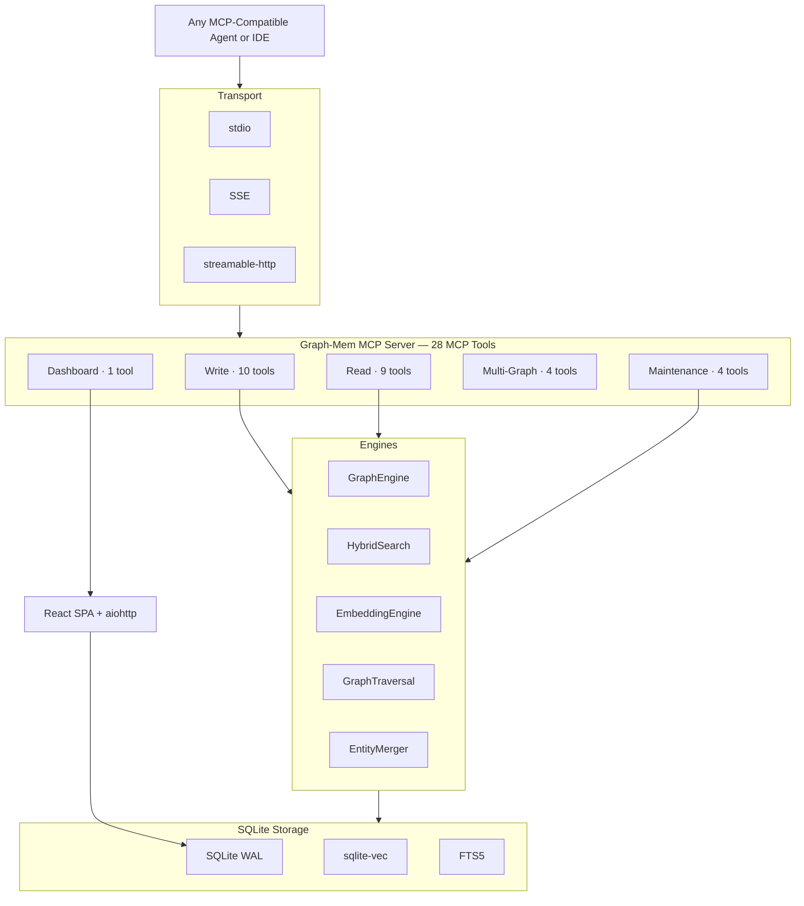

# Graph-Mem MCP

> Persistent knowledge graph memory for AI agents and IDEs

[](LICENSE)
[](https://www.python.org)

Graph-Mem MCP is a universal MCP server that gives any agent or IDE persistent, structured memory through a knowledge graph. It combines graph storage, semantic vector search, and multi-hop traversal in a single package — install it, add it to your MCP config, and your agent gains memory that survives across sessions. It works everywhere MCP does.

### Works With

<table>
<tr>
<td><b>Claude Code</b></td>
<td><b>OpenCode</b></td>
<td><b>Cursor</b></td>
<td><b>Windsurf</b></td>
<td><b>Codex CLI</b></td>
<td><b>Gemini CLI</b></td>
</tr>
<tr>
<td><b>GitHub Copilot</b></td>
<td><b>Amp</b></td>
<td><b>Kiro</b></td>
<td><b>Roo Code</b></td>
<td><b>Trae</b></td>
<td><b>Augment</b></td>
</tr>
<tr>
<td><b>Continue</b></td>
<td><b>Warp</b></td>
<td><b>KiloCode</b></td>
<td><b>Qoder</b></td>
<td><b>CodeBuddy</b></td>
<td><b>Droid (Factory)</b></td>
</tr>
<tr>
<td colspan="6"><b>Antigravity</b> · and any MCP-compatible agent, IDE, or framework</td>
</tr>
</table>

---

## What is this?

AI agents forget everything between sessions. They re-read files, re-discover architecture, and repeat mistakes. **Graph-Mem MCP** solves this by providing persistent, per-project knowledge graphs that any MCP-compatible agent can read and write to. The graph builds organically as the agent works — extracting entities, decisions, and relationships from every conversation. It runs as a standard MCP server with 28 tools that plug into any agent, IDE, or framework that supports the Model Context Protocol.

### Why a graph, not just a vector store?

Vector search finds _similar_ things. Graphs find _connected_ things. When an agent asks "what depends on the auth service?", a vector store returns text that mentions auth. A knowledge graph traverses the actual dependency edges and returns every upstream consumer — even ones that never mention "auth" in their description. Graph-Mem gives you both: vector similarity for fuzzy discovery, graph traversal for structural queries.

### Use Cases

- **Agent memory** — Give any AI coding agent persistent context across sessions
- **IDE integration** — Add knowledge graph tools to Cursor, Windsurf, Copilot, or any MCP-enabled IDE
- **Agent building** — Use as the memory layer when building custom AI agents and workflows
- **Research & knowledge management** — Build structured knowledge bases with semantic search
- **Multi-project context** — Maintain separate knowledge graphs per project with multi-graph support

---

## Quick Start

**1. Install:**

```bash
pip install graph-mem
```

**2. Install the skill for your agent:**

```bash
graph-mem install opencode      # OpenCode
graph-mem install claude        # Claude Code
graph-mem install cursor        # Cursor
graph-mem install windsurf      # Windsurf
graph-mem install codex         # Codex CLI
graph-mem install gemini        # Gemini CLI
graph-mem install copilot       # GitHub Copilot
graph-mem install amp           # Amp
graph-mem install kiro          # Kiro
graph-mem install roocode       # Roo Code
graph-mem install trae          # Trae
graph-mem install augment       # Augment
graph-mem install continue      # Continue
graph-mem install warp          # Warp
graph-mem install kilocode      # KiloCode
graph-mem install qoder         # Qoder
graph-mem install codebuddy     # CodeBuddy
graph-mem install droid         # Droid (Factory)
graph-mem install antigravity   # Antigravity
```

This writes a skill file that teaches your agent how to use all 28 MCP tools — when to search, when to add entities, naming conventions, and common workflows.

**3. Configure MCP** by adding this to your agent's MCP config:

```json
{
  "mcpServers": {
    "graph-mem": {
      "command": "graph-mem",
      "args": ["server"]
    }
  }
}
```

With full customization:

```json
{
  "mcpServers": {
    "graph-mem": {
      "command": "graph-mem",
      "args": [
        "server",
        "--project-dir", "/path/to/my/project",
        "--embedding-model", "sentence-transformers/all-mpnet-base-v2",
        "--use-onnx",
        "--cache-size", "20000",
        "--log-level", "INFO"
      ]
    }
  }
}
```

That's it. Your agent now has persistent memory. Verify by asking it to run `read_graph()`.

---

## One-Prompt Setup

Paste this into your agent's chat to get started immediately:

```
I want you to give yourself persistent memory using graph-mem. Run the following:

pip install graph-mem
graph-mem install opencode    # or: claude, cursor, windsurf, codex, gemini, copilot, amp, kiro, roocode, trae, augment, continue, warp, kilocode, qoder, codebuddy, droid, antigravity

This installs a skill file that teaches you how to use all 28 MCP tools.
The server should already be configured in your MCP config. If not, add it:

{
  "mcpServers": {
    "graph-mem": {
      "command": "graph-mem",
      "args": ["server", "--project-dir", "/path/to/your/project"]
    }
  }
}

Now start using the knowledge graph:

1. read_graph() to see current state
2. search_nodes("relevant topic") to find existing knowledge
3. add_entities, add_relationships, add_observations as you learn things
4. update_observation / update_relationship to fix mistakes in-place
5. open_dashboard() to explore the graph visually in your browser
6. At session end, capture anything important you discovered

Your goal: build a rich knowledge graph of this project so future sessions
start with full context instead of from zero. Search before adding to avoid
duplicates. Be specific with entity names and types.
```

---

## Installation

### Option 1: pip (Recommended)

```bash
pip install graph-mem
graph-mem server
```

### Option 2: uvx (zero pre-install)

```bash
uvx graph-mem server
```

`uvx` downloads the package into an isolated environment and runs it in one command. Nothing to pre-install beyond [uv](https://docs.astral.sh/uv/).

### Option 3: From source

```bash
git clone https://github.com/Sathvik-1007/GraphMem-MCP
cd graph-mem
pip install -e ".[full,dev]"
graph-mem server
```

### Optional extras

```bash
pip install "graph-mem[embeddings]"   # sentence-transformers for local embeddings
pip install "graph-mem[onnx]"         # ONNX runtime for ~3x faster inference
pip install "graph-mem[ui]"           # aiohttp for interactive graph visualisation
pip install "graph-mem[full]"         # all of the above
```

---

## Tools

Graph-Mem exposes **28 MCP tools** — ten for writing, nine for reading, four for maintenance, four for multi-graph management, and one utility. Full CRUD on every primitive: entities, relationships, and observations can all be created, read, updated, and deleted.

### Write Tools (10)

| Tool | Description |
|------|-------------|
| `add_entities` | Batch-create entities with optional observations; auto-merges on name conflict |
| `add_relationships` | Create typed, directed edges between entities; merges duplicates by max weight |
| `add_observations` | Attach factual statements to entities with optional source provenance |
| `update_entity` | Modify entity name, description, properties, or type in-place (rename with collision check) |
| `update_relationship` | Change weight, type, or properties of an existing edge without delete+re-create |
| `update_observation` | Edit observation text content in-place with automatic embedding recompute |
| `delete_entities` | Remove entities with cascade to relationships, observations, and embeddings |
| `delete_relationships` | Remove specific edges between entities, optionally filtered by type |
| `delete_observations` | Remove specific observations by ID with ownership validation |
| `merge_entities` | Combine duplicate entities: moves observations and relationships, deduplicates edges |

### Read Tools (9)

| Tool | Description |
|------|-------------|
| `search_nodes` | Hybrid semantic + full-text search with RRF fusion ranking |
| `search_observations` | Semantic search directly over observation text content |
| `find_connections` | Multi-hop BFS graph traversal with direction and type filters |
| `get_entity` | Full entity details with all observations and relationships |
| `list_entities` | Browse/paginate all entities with optional type filter |
| `list_relationships` | Browse/paginate relationships with entity, type, or combined filters |
| `read_graph` | Graph statistics: counts, type distributions, most-connected entities |
| `get_subgraph` | Extract neighborhood subgraph around seed entities |
| `find_paths` | Find shortest paths between two entities via BFS |

### Maintenance Tools (4)

| Tool | Description |
|------|-------------|
| `graph_health` | Health stats: counts, hotspots, missing descriptions, suggested actions |
| `compact_observations` | Atomic observation compaction — delete old and add merged summaries in one step |
| `suggest_connections` | Find semantically similar entities for a node to connect to |
| `audit_graph` | Full quality screening — disconnected nodes, missing data, weak links (plain text report) |

### Visualization (1)

| Tool | Description |
|------|-------------|
| `open_dashboard` | Launch interactive graph visualisation UI and return its URL |

### Multi-Graph Tools (4)

| Tool | Description |
|------|-------------|
| `list_graphs` | List all named graphs in the `.graphmem/` directory with entity/relationship/observation counts |
| `create_graph` | Create a new named graph (`.graphmem/<name>.db`) |
| `switch_graph` | Switch the active graph — hot-swaps storage, search, and graph engines |
| `delete_graph` | Delete a named graph (cannot delete the currently active graph) |

> **Multi-graph storage**: Each named graph is a separate SQLite database in `.graphmem/`. The default graph is `graph.db`. Use `--graph <name>` on CLI commands to target a specific graph.

---

## Architecture



Everything lives in a single SQLite database per project. The server communicates over MCP's standard stdio transport (SSE and streamable-http also supported) and stores all data in `.graphmem/graph.db` at your project root. The database file is portable — copy it between machines, check it into version control, or back it up like any other file.

For detailed technical documentation — data model, search pipeline, entity resolution, storage architecture, and request flow diagrams — see **[How It Works](how-it-works.md)**.

---

## MCP Integration

Graph-Mem MCP is a standard MCP server. It communicates with your agent over the Model Context Protocol (stdio by default, SSE and streamable-http also supported) and exposes 28 tools that the agent calls directly — the same way it calls any other MCP tool. It works with every MCP-compatible agent, IDE, and framework out of the box.

To verify it's working, ask your agent to run `read_graph()` — it should return the current graph statistics.

---

## Graph Visualisation

```bash
graph-mem ui                              # open interactive graph explorer
graph-mem ui --no-open                    # start server without opening browser
graph-mem ui --port 9090                  # use a specific port
graph-mem ui --graph harry-potter         # open a specific named graph
```

The `open_dashboard` MCP tool also starts this UI server and returns the URL directly to your agent.

**Dashboard features:**
- **Force-directed graph canvas** with real-time physics simulation
- **Entity type filtering** — toggle visibility of entity types via sidebar checkboxes
- **Click-to-focus** — click a node on the graph or sidebar to instantly center and zoom to it
- **Inline entity editing** — click any field (name, type, description) in the detail panel to edit it in-place
- **Property management** — add, edit, and delete individual properties per entity with per-row controls
- **Observation management** — add, edit, and delete observations with confirmation dialogs and inline editing
- **Relationship navigation** — click related entities to navigate the graph
- **Entity creation and deletion** — create new entities from the sidebar, delete with confirmation from the detail panel danger zone
- **Hybrid search** — semantic + keyword search across all entities
- **Graph picker** — switch between named graphs without restarting the server
- **Physics controls** — adjust spring, repulsion, damping, and gravity in real-time
- **Keyboard shortcuts** — Space (reheat), F (fit to view), Escape (deselect)

---

## Data Storage

By default, Graph-Mem stores its database at `.graphmem/graph.db` relative to the current working directory. You can control this with:

| Method | Example | Result |
|--------|---------|--------|
| `--project-dir` | `--project-dir /home/user/myproject` | Stores at `/home/user/myproject/.graphmem/graph.db` |
| `--db` | `--db /custom/path/memory.db` | Stores at exactly that path |
| `GRAPHMEM_DB_PATH` env | `export GRAPHMEM_DB_PATH=/tmp/test.db` | Stores at that path |
| Default | (nothing) | `.graphmem/graph.db` relative to CWD |

**Priority order:** `--db` > `--project-dir` > `GRAPHMEM_DB_PATH` env var > default.

The `.graphmem/` directory is automatically created if it doesn't exist. Add `.graphmem/` to your `.gitignore` if you don't want to track the database in version control.

---

## CLI Reference

### Server

```bash
graph-mem server                          # stdio transport (default)
graph-mem server --transport sse          # SSE transport
graph-mem server --db /path/to/graph.db   # custom database path
graph-mem server --project-dir /my/project  # store memory in <dir>/.graphmem/
graph-mem server --project-dir /my/project --graph harry-potter  # use named graph

# Embedding customization
graph-mem server --embedding-model sentence-transformers/all-mpnet-base-v2
graph-mem server --no-onnx --embedding-device cuda
graph-mem server --cache-size 50000

# Tuning
graph-mem server --search-limit 20 --max-hops 6
graph-mem server --log-level DEBUG
```

All server options:

| Flag | Description | Default |
|------|-------------|---------|
| `--transport` | `stdio`, `sse`, or `streamable-http` | `stdio` |
| `--db` | Path to SQLite database file | `.graphmem/graph.db` |
| `--project-dir` | Project root; DB at `<dir>/.graphmem/graph.db` | CWD |
| `--graph` | Named graph (resolves to `<dir>/.graphmem/<name>.db`) | `graph` |
| `--host` | Bind address (SSE/HTTP only) | `127.0.0.1` |
| `--port` | Port (SSE/HTTP only) | `8080` |
| `--embedding-model` | HuggingFace model ID for embeddings | `all-MiniLM-L6-v2` |
| `--use-onnx / --no-onnx` | Force ONNX runtime on/off | auto-detect |
| `--embedding-device` | `cpu` or `cuda` | `cpu` |
| `--cache-size` | Embedding LRU cache max entries | `10000` |
| `--search-limit` | Default max results for `search_nodes` | `10` |
| `--max-hops` | Default max depth for `find_connections` | `4` |
| `--log-level` | `DEBUG` / `INFO` / `WARNING` / `ERROR` / `CRITICAL` | `WARNING` |

### Skill Installation

```bash
graph-mem install <agent>                 # project-level install
graph-mem install <agent> --global        # global/user-level install
graph-mem install <agent> --domain code   # use domain overlay (code, research, general)
```

Supported agents: `claude`, `opencode`, `cursor`, `windsurf`, `codex`, `gemini`, `copilot`, `amp`, `kiro`, `roocode`, `trae`, `augment`, `continue`, `warp`, `kilocode`, `qoder`, `codebuddy`, `droid`, `antigravity`.

### Graph Management

```bash
graph-mem init                            # create .graphmem/ directory
graph-mem init --project-dir /my/project  # create in specific directory
graph-mem init --graph research           # create a named graph
graph-mem status                          # print graph statistics
graph-mem status --json                   # graph statistics as JSON
graph-mem status --graph research         # status of a named graph
graph-mem export --format json            # export entire graph
graph-mem export --output backup.json     # export to file
graph-mem import graph.json               # import graph from file
graph-mem validate                        # run integrity checks
```

All management commands accept `--db`, `--project-dir`, and `--graph` for targeting a specific database.

**Multi-graph support**: Use `--graph <name>` to work with named graphs stored as `.graphmem/<name>.db`. Without `--graph`, commands target the default `graph.db`. The MCP tools `list_graphs`, `create_graph`, `switch_graph`, and `delete_graph` provide runtime graph management for agents.

---

## Configuration

All settings are optional. Defaults work out of the box. Every setting can be controlled via CLI flags (see `graph-mem server --help`), environment variables, or both. CLI flags take precedence over environment variables, which take precedence over defaults.

| Environment Variable | CLI Flag | Default | Description |
|---------------------|----------|---------|-------------|
| `GRAPHMEM_DB_PATH` | `--db` | `.graphmem/graph.db` | Database file path |
| `GRAPHMEM_BACKEND_TYPE` | -- | `sqlite` | Storage backend |
| `GRAPHMEM_EMBEDDING_MODEL` | `--embedding-model` | `all-MiniLM-L6-v2` | HuggingFace model ID |
| `GRAPHMEM_USE_ONNX` | `--use-onnx / --no-onnx` | `false` | Use ONNX runtime if available |
| `GRAPHMEM_EMBEDDING_DEVICE` | `--embedding-device` | `cpu` | Inference device (`cpu` or `cuda`) |
| `GRAPHMEM_CACHE_SIZE` | `--cache-size` | `10000` | Embedding cache max entries |
| `GRAPHMEM_SEARCH_LIMIT` | `--search-limit` | `10` | Default search result limit |
| `GRAPHMEM_MAX_HOPS` | `--max-hops` | `4` | Default max traversal depth |
| `GRAPHMEM_LOG_LEVEL` | `--log-level` | `WARNING` | Logging verbosity |
| `GRAPHMEM_TRANSPORT` | `--transport` | `stdio` | MCP transport protocol |

---

## Performance

- **WAL mode + PRAGMA tuning** — concurrent reads with fast writes, optimized journal and cache settings
- **ONNX-optimized embeddings** — ~3x faster inference than default PyTorch, with automatic fallback
- **Content-hash embedding cache** — identical text is never embedded twice
- **Background model pre-warming** — embedding model loads in a background thread during startup
- **Thread-safe lazy loading** — double-check locking for safe concurrent access
- **Memory-mapped I/O** — large databases stay fast without consuming proportional RAM
- **Batch transactions** — bulk operations execute in a single transaction

---

## Development

```bash
git clone https://github.com/Sathvik-1007/GraphMem-MCP
cd graph-mem

# Using uv (recommended)
uv venv
uv pip install -e ".[full,dev]"

# Or using pip
python -m venv .venv
source .venv/bin/activate
pip install -e ".[full,dev]"
```

### Running Tests

```bash
pytest                            # all tests
pytest tests/test_graph/          # graph engine tests
pytest tests/test_server/         # MCP server tool tests (all 28 tools)
pytest tests/test_cli/            # CLI command tests
pytest tests/test_models/         # data model tests
pytest tests/test_semantic/       # search + vector tests
pytest tests/test_storage/        # storage backend tests
pytest tests/test_db/             # database + migration tests
pytest tests/test_utils/          # config, logging, ID generation tests
pytest -x -q                      # stop on first failure, quiet output
```

---

## Star History

<a href="https://www.star-history.com/?repos=Sathvik-1007%2FGraphMem-MCP&type=date&legend=top-left">
 <picture>
   <source media="(prefers-color-scheme: dark)" srcset="https://api.star-history.com/image?repos=Sathvik-1007/GraphMem-MCP&type=date&theme=dark&legend=top-left" />
   <source media="(prefers-color-scheme: light)" srcset="https://api.star-history.com/image?repos=Sathvik-1007/GraphMem-MCP&type=date&legend=top-left" />
   
 </picture>
</a>

---

## License

[MIT](LICENSE)
