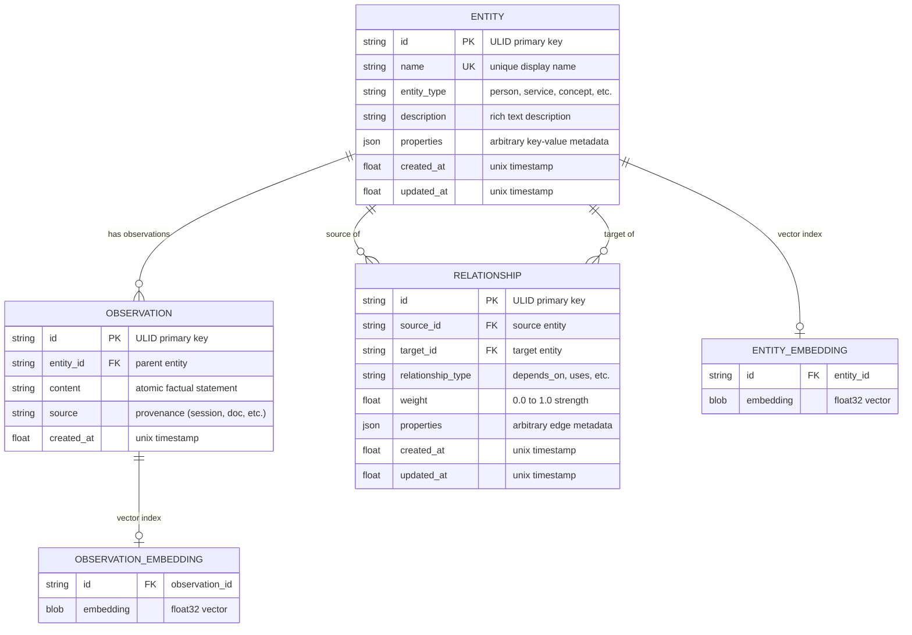
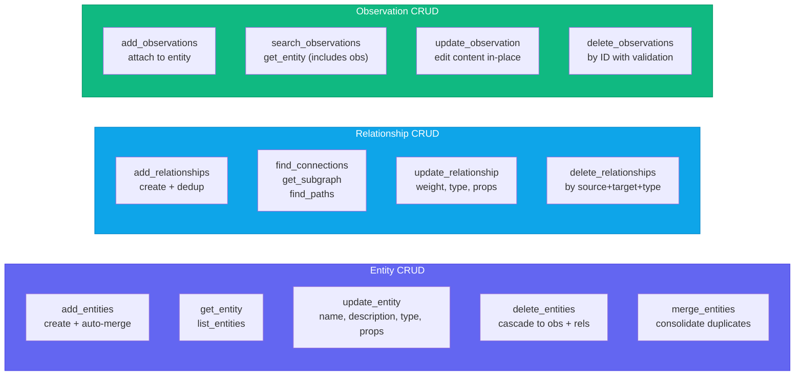
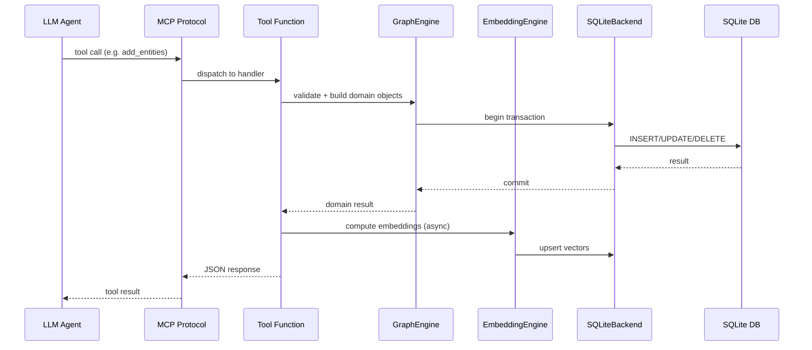
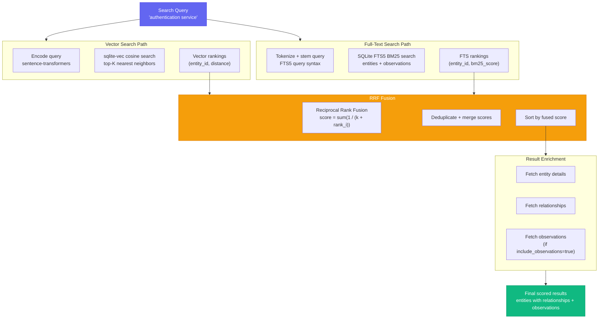
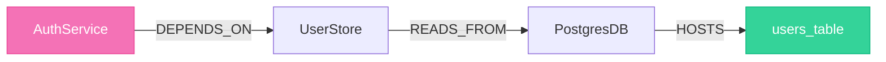
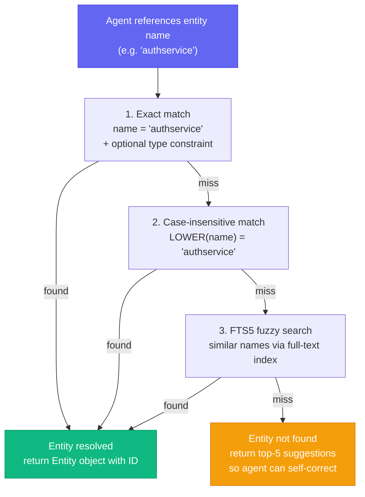
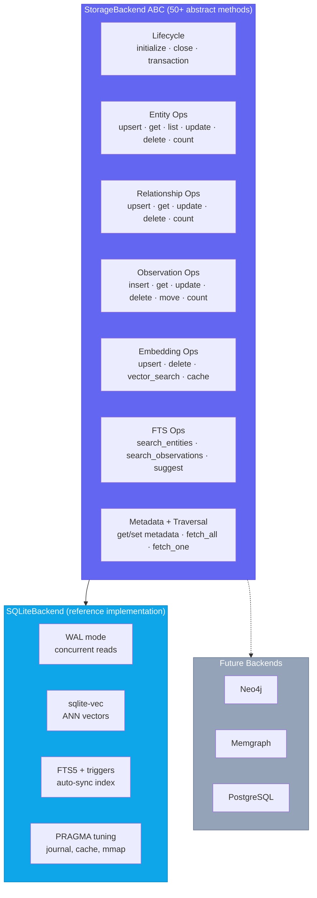
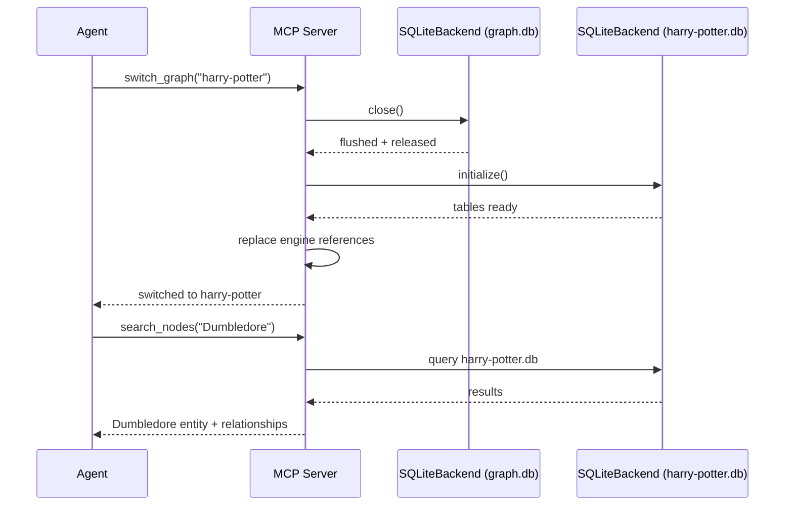
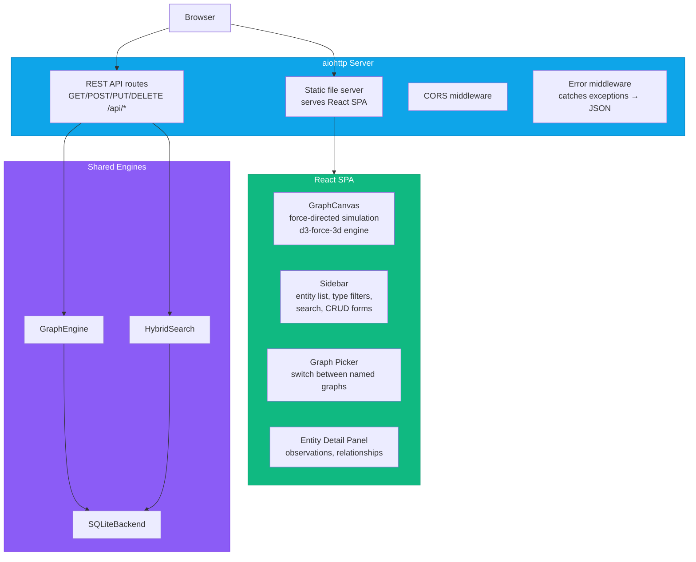

# How It Works

> Deep technical reference for graph-mem internals. For installation and usage, see the [README](README.md).

---

## Data Model

The knowledge graph has three core primitives. Every primitive supports full CRUD -- create, read, update, and delete:



- **Entities** are named nodes with a type and description (e.g., `AuthService`, type `service`).
- **Relationships** are typed, directed, weighted edges between entities (e.g., `AuthService --DEPENDS_ON--> Database`).
- **Observations** are factual statements attached to entities (e.g., "Uses bcrypt for password hashing").
- **Embeddings** are sentence-transformer vectors stored alongside entities and observations for semantic search.

---

## CRUD Operations Map



---

## Tool Request Flow

Every tool call follows the same pattern through the stack:



---

## Hybrid Search Pipeline

`search_nodes` combines three retrieval strategies using Reciprocal Rank Fusion (RRF):



1. **Vector similarity** -- cosine distance against sentence-transformer embeddings of entity names, descriptions, and observations.
2. **Full-text search** -- SQLite FTS5 with BM25 ranking for keyword matching.
3. **RRF fusion** -- merges and re-ranks results from both strategies into a single scored list.

When no embedding model is installed, search gracefully degrades to FTS-only mode.

---

## Multi-Hop Traversal

`find_connections` walks the graph recursively using SQL CTEs, discovering indirect relationships up to a configurable depth. This surfaces connections that no flat search can find -- like tracing a function through three layers of abstraction to the database schema it ultimately modifies.



A query like `find_connections("AuthService", max_hops=3)` traverses the full chain `AuthService -> UserStore -> PostgresDB -> users_table`, even though `users_table` never mentions "auth."

---

## Entity Resolution

When the agent references an entity by name, graph-mem resolves it through a cascade:



1. **Exact match** -- case-sensitive name lookup, optionally scoped by entity type.
2. **Case-insensitive match** -- normalized comparison.
3. **FTS5 match** -- full-text search for partial or fuzzy names.
4. **Suggestions** -- if nothing matches, return the closest candidates so the agent can self-correct.

---

## Storage Backend Architecture



---

## Project Structure

```mermaid
graph TD
    Root["src/graph_mem/"]

    Entry["server.py<br/>MCP entry point<br/>23 tool definitions<br/>lifespan + embedding helpers"]
    CLI["cli/<br/>main.py -- Click CLI commands<br/>install.py -- 19-agent skill installer"]
    DB["db/<br/>connection.py -- aiosqlite wrapper<br/>schema.py -- migration runner<br/>migrations/ -- versioned SQL"]
    GraphMod["graph/<br/>engine.py -- CRUD + entity resolution<br/>traversal.py -- BFS + pathfinding + subgraph<br/>merge.py -- entity consolidation"]
    Models["models/<br/>entity.py -- Entity dataclass<br/>relationship.py -- Relationship dataclass<br/>observation.py -- Observation dataclass"]
    SemanticMod["semantic/<br/>embeddings.py -- lazy model + ONNX + cache<br/>search.py -- hybrid vector+FTS5+RRF"]
    StorageMod["storage/<br/>base.py -- StorageBackend ABC (50+ methods)<br/>sqlite_backend.py -- reference impl<br/>__init__.py -- backend registry"]
    UIMod["ui/<br/>server.py -- aiohttp app factory<br/>routes.py -- REST API endpoints<br/>frontend/ -- pre-built React SPA"]
    Utils["utils/<br/>config.py -- Config dataclass + env vars<br/>errors.py -- 14 error classes<br/>ids.py -- ULID generation<br/>logging.py -- structured logging"]

    Root --> Entry
    Root --> CLI
    Root --> DB
    Root --> GraphMod
    Root --> Models
    Root --> SemanticMod
    Root --> StorageMod
    Root --> UIMod
    Root --> Utils

    style Root fill:#6366f1,stroke:#4f46e5,color:#fff
    style Entry fill:#0ea5e9,stroke:#0284c7,color:#fff
```



| Module | Responsibility |
|--------|---------------|
| `server.py` | MCP server entry point, registers all 23 tools, lifespan management, embedding orchestration |
| `cli/` | Click CLI commands (server, init, status, export, import, validate, ui) + skill installer for 19 agents |
| `db/` | Database class (aiosqlite, WAL mode, PRAGMA tuning) + versioned migrations |
| `graph/` | GraphEngine CRUD, BFS traversal, path-finding, subgraph extraction, entity merging |
| `models/` | Dataclasses for Entity, Relationship, Observation |
| `semantic/` | EmbeddingEngine (lazy loading, ONNX, content-hash cache) + HybridSearch (vector + FTS5 + RRF) |
| `storage/` | StorageBackend ABC (50+ methods) + SQLiteBackend reference implementation + backend registry |
| `ui/` | aiohttp web server + REST API routes + pre-built React SPA graph explorer |
| `utils/` | Config, structured logging, error hierarchy (14 classes), ULID generation |

---

## Multi-Graph Architecture

graph-mem supports multiple named graphs per project. Each graph is a fully independent SQLite database stored in the `.graphmem/` directory:

```
.graphmem/
├── graph.db           # default graph
├── harry-potter.db    # named graph: "harry-potter"
├── research.db        # named graph: "research"
└── codebase.db        # named graph: "codebase"
```

### How switching works

When an agent calls `switch_graph("harry-potter")`, the server:

1. **Resolves the path** -- `<project_dir>/.graphmem/harry-potter.db`
2. **Closes the current storage backend** -- flushes WAL, releases file handles
3. **Creates a new SQLiteBackend** pointing at the target database file
4. **Initializes** -- runs migrations, creates tables if the DB is new
5. **Hot-swaps engines** -- replaces the `GraphEngine`, `HybridSearch`, and `GraphTraversal` instances with new ones backed by the new storage
6. **Returns confirmation** -- the agent immediately sees data from the new graph

All 23 MCP tools operate on whichever graph is currently active. No tool call needs a graph parameter -- the active graph is implicit server state.



### CLI graph targeting

CLI commands accept `--graph <name>` to target a specific graph without switching the server's active graph:

```bash
graph-mem status --graph harry-potter   # stats for harry-potter.db
graph-mem export --graph research       # export research.db
graph-mem ui --graph codebase           # visualise codebase.db
```

---

## Graph Visualisation UI

The `open_dashboard` tool (and `graph-mem ui` CLI command) launches a web-based graph explorer built with aiohttp + React:



### REST API endpoints

The UI backend exposes these endpoints:

| Method | Path | Description |
|--------|------|-------------|
| `GET` | `/api/graph` | Full graph data (entities + relationships) for canvas rendering |
| `GET` | `/api/entity/:name` | Entity detail with observations and relationships |
| `POST` | `/api/entity` | Create a new entity |
| `PUT` | `/api/entity/:name` | Update entity name, description, type, or properties |
| `DELETE` | `/api/entity/:name` | Delete entity (cascades to observations + relationships) |
| `GET` | `/api/search?q=...` | Hybrid search across all entities |
| `GET` | `/api/stats` | Graph statistics (counts, distributions, most-connected) |
| `GET` | `/api/graphs` | List all named graphs with counts |
| `POST` | `/api/graphs/switch` | Switch active graph |

### Canvas rendering

The graph canvas uses a force-directed simulation powered by `d3-force-3d`:

- **Nodes** are entities, sized by connection count and colored by entity type
- **Links** are relationships, with labels showing the relationship type
- **Physics** is configurable: spring strength, repulsion, damping, gravity
- **Focus** -- clicking a node or sidebar entry smoothly animates the camera to center on it
- **Keyboard shortcuts** -- Space (reheat simulation), F (fit all nodes in view), Escape (deselect)
